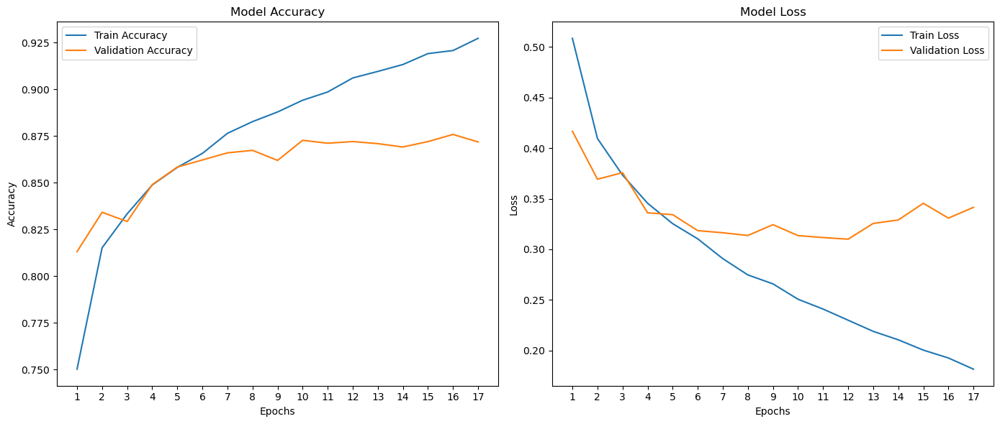
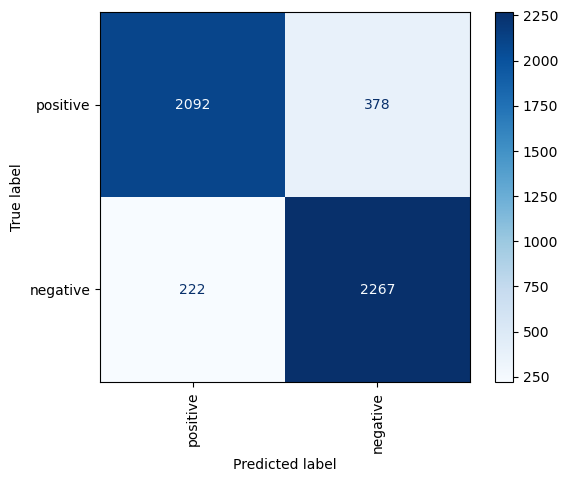
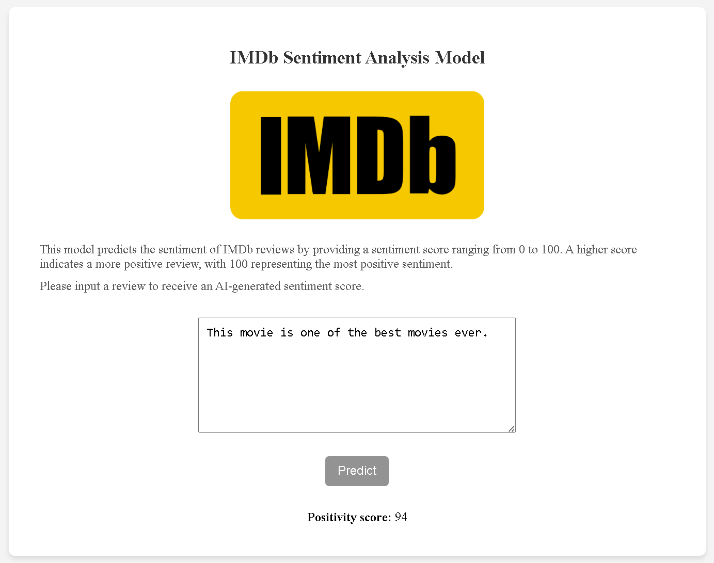

# IMDb Sentiment Analysis

## 1. Introduction

This project involves developing a sentiment analysis system for IMDb movie reviews. Using a custom-trained deep learning model, the application provides a positivity score ranging from 0 to 100, where 100 indicates the most positive sentiment. A Flask-based web interface allows users to input reviews and receive predictions in real-time.

## 2. Dataset and Preprocessing

The dataset consists of IMDb movie reviews, evenly balanced between positive and negative sentiments. A detailed preprocessing pipeline was applied to prepare the data for modeling:

### Preprocessing Steps

1. **Lowercase Text**: All text was converted to lowercase for consistency.
2. **Expand Contractions**: Common contractions (e.g., "don't") were expanded into their full forms (e.g., "do not") using the `contractions` library.
3. **Remove Non-Alphabetic Characters**: Special characters, numbers, and symbols were removed to retain only textual information.
4. **Spelling Correction**: The SymSpell library was used to correct misspelled words, referencing a frequency-based dictionary.
5. **Remove Stopwords**: Commonly used words with little semantic meaning (e.g., "the," "is") were removed, except for custom stopwords that carry sentiment (e.g., "not," "but").
6. **Lemmatize Tokens**: Each word was reduced to its base form (e.g., "running" → "run") using WordNet and part-of-speech tagging.
7. **Remove Invalid Words**: Tokens not found in the English lexicon were discarded.

After preprocessing, sentiments were encoded as binary classes: `1` for positive and `0` for negative. The dataset was split into training, validation, and test sets for model development and evaluation.

## 3. Model Development

The model was developed using a Bidirectional LSTM network to capture both forward and backward contextual dependencies in the reviews.

### Key Features of the Model

- **GloVe Embeddings**: Pre-trained word vectors were used to represent tokens as dense numerical arrays, encoding semantic relationships.
- **Bidirectional LSTM**: A recurrent neural network architecture that processes sequences in both directions to enhance context comprehension.
- **Dropout Layers**: Introduced to mitigate overfitting during training.
- **Sigmoid Activation**: Outputs a single value representing the positivity score.

### Training Process

- **Input Preparation**: Preprocessed text was tokenized and padded to a uniform sequence length of 100 tokens.
- **Optimization**: The Adam optimizer was used, and binary cross-entropy was selected as the loss function.
- **Early Stopping**: Training was stopped when the validation loss no longer improved, preventing overfitting.
- **Output**: The trained model was saved as `model.pkl`.

### Performance Metrics

The model's performance was evaluated using training and validation accuracy and loss:

- **Accuracy**: The model demonstrated steady improvement, achieving high accuracy on both training and validation datasets.
- **Loss**: Both training and validation loss decreased over time, indicating effective learning.

The confusion matrix below shows the model's predictions on the test set:

## 4. Web Application

The trained model was integrated into a Flask web application to provide an interactive interface for sentiment analysis.

### Application Features

- **Input**: Users can submit a review via a text box.
- **Output**: The model predicts the positivity score, which is displayed on the page.

### Backend Functionality

- **Text Processing**: Input reviews are preprocessed in real-time using the same steps applied during training.
- **Prediction**: The processed text is passed to the model, which outputs a positivity score.

## 5. Challenges and Future Work

### Challenges

- **Spelling and Grammar Variations**: Diverse text patterns, such as spelling errors and slang, can affect preprocessing and model predictions.
- **Complex Sentiments**: Understanding nuanced expressions like sarcasm remains challenging.

### Future Work

- **Contextual Models**: Experiment with transformer-based architectures like BERT to improve understanding of nuanced sentiments.
- **Multi-Language Support**: Extend the system to analyze reviews in languages other than English.
- **Cloud Deployment**: Host the application on cloud platforms to ensure scalability and wider accessibility.

## 6. Conclusion

This project demonstrates a robust sentiment analysis system that combines advanced text preprocessing, a custom-trained deep learning model, and an intuitive web interface. By providing a positivity score for reviews, the system offers a practical solution for sentiment analysis. With future enhancements, it can become even more versatile and accessible.
